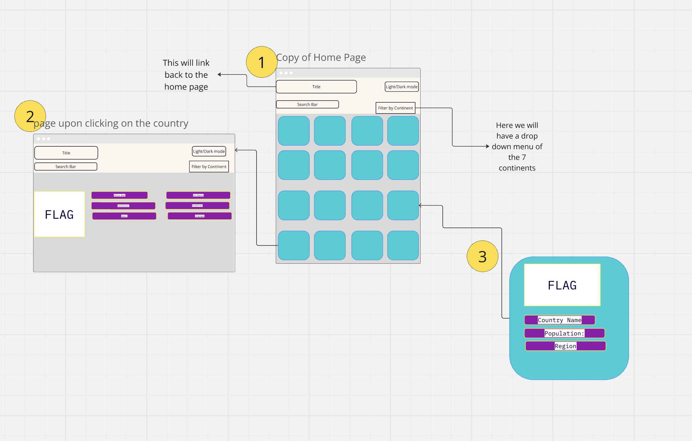

# GeoSphere

Created by Fiona, and Veshona

## 🚀 Mission statement

Our application,  is for people who want to see the country flags. It allows users to see the country names, flags, population, overall information for each country

## API & React Router

This application will use the REST Countries API. Below are the documentation and specific endpoints we intend to use and the front-end pages that will use them.

- Link to API documentation: https://restcountries.com/

- [API endpoint #1](https://restcountries.com/v3.1/all)
(https://restcountries.com/v3.1/all)
  - All of the information
  - List of data values used by the endpoint
  ___
- [API endpoint #2](https://restcountries.com/v3.1/all?fields=name,capital,continents,currencies)

(https://restcountries.com/v3.1/all?fields=name,capital,continents,currencies)
  - This will fetch the `name`, `capital`,`continents`,`currencies`
  - `name`, `capital`,`continents`,`currencies`
  ___
- [API endpoint #3](https://restcountries.com/v3.1/all?fields=flags)
(https://restcountries.com/v3.1/all?fields=flags)
  - This will fetch the `flags` object that includes the  `png`,`svg`,`alt`
  - I will be using the `svg`

[If your API requires an API key, say so here.]

## 👩‍💻 MVP User Stories & Frontend Routes

The application will feature the following frontend routes and core features:

* On the `Main` page, users can see the countries and are able to scroll through the country cards
* On the `second` page, users can click on the country card and will be getting more information on the country selected
* On the `search button`, you can search the country name and be presented with the selected country

## 🤔 Stretch User Stories

If time permits, the following stretch features will be implemented in order of priority:

* Users will be able to change the color scheme of the website from light mode to dark mode

## 📆 Timeline for reaching MVP in 1 week

To ensure that we can complete all core features of the application in 1 week, we will aim to complete tasks according to the following timeline:

**Day 1**
- [ ] Ticket description and due date
- [ ] Ticket description and due date
- [ ] Ticket description and due date

**Day 2**
- [ ] Ticket description and due date
- [ ] Ticket description and due date
- [ ] Ticket description and due date

**Day 3** (MVP due by the end of the day)
- [ ] Ticket description and due date
- [ ] Ticket description and due date
- [ ] Ticket description and due date

**Day 4**
- [ ] Ticket description and due date
- [ ] Ticket description and due date
- [ ] Ticket description and due date

**Day 5**
- [ ] Ticket description and due date
- [ ] Ticket description and due date
- [ ] Ticket description and due date

## Wireframes of each page in your application

Below, you can find wireframes for our project. Each wireframe shows a different page of our application as well as the key components of the application. Details such as specific text values or images are intentionally not included:

Wireframe : 

